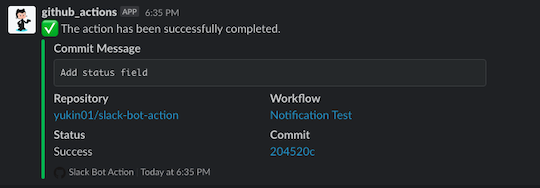

# slack-bot-action

This action allows you to notify the slack of the result of the workflow, using the Web API `chat.postMessage` (formerly Bot User), not Webhook.

## Usage

```yaml
steps:
  - name: Notify job result
    uses: yukin01/slack-bot-action@master
    with:
      status: ${{ job.status }}
      oauth_token: ${{ secrets.SLACK_OAUTH_TOKEN }}
      channel: general
    if: always()
```



## Input

The following inputs are supported.

- `status` - (required) Job results. In most use cases, you should specify `${{ job.status }}`. If you want to express your own status, you can enter any value.

- `github_token` - (optional) Personal access token (PAT) used to fetch the repository. Defaults to `${{ github.token }}`

- `oauth_token` - (required) Slack's access token. If you're using modern Slack Apps, specify the **Bot User OAuth Access Token** which begin with `xoxb-`.

- `channel` - (required) The channel to be notified of results.

For more information, see https://api.slack.com/methods/chat.postMessage.

## Output

This action does not configure any outputs.
